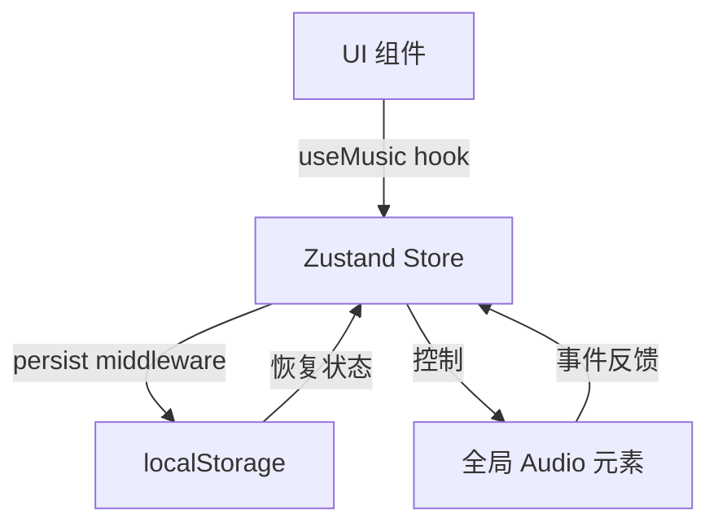

# 状态管理架构详解

## 🎯 状态管理方案：Zustand + localStorage + 全局 Audio 元素

### 📊 三层状态管理架构



### 🔄 完整的数据流动

```typescript
// 1. 用户点击播放按钮
<EnhancedMusicPlayer />
  ↓ onClick
// 2. 调用 hook 方法
useMusic().togglePlay()
  ↓
// 3. hook 操作 Zustand Store
useMusicStore.setState({ isPlaying: !isPlaying })
  ↓
// 4. Zustand 触发组件更新
<EnhancedMusicPlayer /> 重新渲染 (isPlaying 状态变化)
  ↓
// 5. useEffect 监听状态变化，控制 Audio 元素
useEffect(() => {
  if (isPlaying) audio.play()
  else audio.pause()
}, [isPlaying])
```

### 🆚 与其他状态管理方案对比

| 方案 | Zustand | Redux | Context API | LocalStorage |
|------|---------|-------|-------------|--------------|
| **复杂度** | ⭐⭐ 简单 | ⭐⭐⭐⭐⭐ 复杂 | ⭐⭐⭐ 中等 | ⭐⭐⭐ 较复杂 |
| **性能** | ⭐⭐⭐⭐⭐ 优秀 | ⭐⭐⭐⭐ 良好 | ⭐⭐ 一般 | ⭐⭐⭐⭐ 优秀 |
| **持久化** | ⭐⭐⭐⭐⭐ 内置 | ⭐⭐⭐ 需插件 | ⭐⭐ 手动 | ⭐⭐⭐⭐⭐ 天然 |
| **TypeScript** | ⭐⭐⭐⭐⭐ 完美 | ⭐⭐⭐⭐ 良好 | ⭐⭐⭐ 一般 | ⭐⭐⭐ 需手动 |
| **学习曲线** | ⭐⭐ 平缓 | ⭐⭐⭐⭐ 陡峭 | ⭐⭐⭐ 中等 | ⭐⭐⭐ 中等 |

### 🎨 为什么选择 Zustand？

#### ✅ **优势**
1. **零样板代码** - 不需要 actions, reducers, providers
2. **自动性能优化** - 只重新渲染使用到的组件
3. **内置中间件** - persist, devtools, immer 等
4. **完美的 TypeScript 支持** - 类型推断完整
5. **轻量级** - 只有 ~1KB (vs Redux ~15KB)

#### 📝 **代码对比**

```typescript
// ❌ Redux - 需要 actions, reducers, constants
// constants.js
export const SET_VOLUME = 'SET_VOLUME';
export const SET_PLAYING = 'SET_PLAYING';

// actions.js
export const setVolume = (volume) => ({
  type: SET_VOLUME,
  payload: volume
});

// reducer.js
const reducer = (state, action) => {
  switch (action.type) {
    case SET_VOLUME:
      return { ...state, volume: action.payload };
    // ...
  }
};

// store.js
const store = createStore(reducer);

// ❌ Context API - 需要创建 Context, Provider
const MusicContext = createContext();

function MusicProvider({ children }) {
  const [state, setState] = useState({
    volume: 0.7,
    isPlaying: false
  });

  return (
    <MusicContext.Provider value={{ state, setState }}>
      {children}
    </MusicContext.Provider>
  );
}

// ✅ Zustand - 简单直接
const useMusicStore = create((set) => ({
  volume: 0.7,
  isPlaying: false,
  setVolume: (volume) => set({ volume }),
  togglePlay: () => set((state) => ({ isPlaying: !state.isPlaying }))
}));

// 使用时直接调用
const { volume, togglePlay } = useMusicStore();
```

### 🛠️ 持久化架构

```typescript
// Zustand + localStorage 的配合
persist(
  (set, get) => ({
    // 状态定义
    currentSong: null,
    playlist: [],
    // ...
  }),
  {
    name: "music-player-storage",  // localStorage key
    partialize: (state) => ({
      // 只持久化部分状态
      volume: state.volume,
      playMode: state.playMode,
      // 不持久化临时状态
      // isPlaying: state.isPlaying  // 用户刷新时暂停，不自动播放
    }),
  }
)()

// 🔄 数据流动：
// 1. 状态变化 → Zustand Store
// 2. persist 中间件 → 自动同步到 localStorage
// 3. 页面刷新 → 从 localStorage 恢复状态
// 4. 恢复完成 → 组件获得最新状态
```

### 🎵 全局 Audio 元素策略

```
为什么需要全局 Audio 元素？

问题：React 组件卸载时，状态会被重置
方案：将 Audio 元素放在 React 外部

实现：
let globalAudioElement: HTMLAudioElement | null = null;

// 第一次挂载时创建
if (!globalAudioElement) {
  globalAudioElement = new Audio();
}

// 后续挂载时复用
audioRef.current = globalAudioElement;
```

### 🎯 完整的状态管理流程

```
┌─────────────────────────────────────────────────────────┐
│ 1. 用户操作：点击播放按钮                                │
└───────────────┬─────────────────────────────────────────┘
                ↓
┌─────────────────────────────────────────────────────────┐
│ 2. UI 组件调用 hook 方法                                 │
│    togglePlay() → useMusicStore.setState()              │
└───────────────┬─────────────────────────────────────────┘
                ↓
┌─────────────────────────────────────────────────────────┐
│ 3. Zustand Store 更新状态                               │
│    isPlaying: false → true                              │
│    persist 中间件同步到 localStorage                     │
└───────────────┬─────────────────────────────────────────┘
                ↓
┌─────────────────────────────────────────────────────────┐
│ 4. 组件重新渲染（响应状态变化）                          │
│    使用到的组件自动更新                                  │
└───────────────┬─────────────────────────────────────────┘
                ↓
┌─────────────────────────────────────────────────────────┐
│ 5. useEffect 监听状态变化，控制 Audio 元素               │
│    isPlaying 变化 → audio.play() / audio.pause()        │
└───────────────┬─────────────────────────────────────────┘
                ↓
┌─────────────────────────────────────────────────────────┐
│ 6. Audio 元素播放状态变化                                │
│    触发事件：play, pause, ended, error                 │
└───────────────┬─────────────────────────────────────────┘
                ↓
┌─────────────────────────────────────────────────────────┐
│ 7. 事件处理器更新 Zustand 状态                           │
│    音频播放结束 → nextSong()                            │
└─────────────────────────────────────────────────────────┘
```

### 💡 关键设计决策

1. **为什么用 Zustand 而不是 Context API？**
   - 更好的性能 (自动优化重新渲染)
   - 更简单的 API (不需要 Providers)
   - 更好的 TypeScript 支持

2. **为什么需要全局 Audio 元素？**
   - 避免组件卸载时重置播放状态
   - 实现跨页面连续播放
   - 减少音频资源重复加载

3. **为什么需要持久化？**
   - 用户刷新页面后保持设置
   - 跨会话记住用户偏好
   - 提升用户体验

这个架构实现了：
✅ 高性能 (智能渲染)
✅ 状态持久化 (不丢失数据)
✅ 跨页面播放 (全局 Audio)
✅ 简洁的代码 (Zustand 优势)
